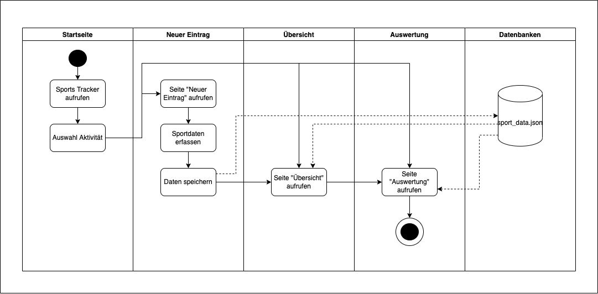

# Sports Tracker
***
## Inhalt
***
1. [Problembeschreibung / Motivation](#problembeschreibung-/-motivation)
2. [Betrieb / Instalation](#betrieb-/-instalation)
3. [Benutzung](#benutzung)
4. [Architektur](#architektur)
5. [Ungelöste / unbearbeitete Probleme](ungeloeste-/-unbearbeitete-probleme)

## Problembeschreibung / Motivation
***
Im Rahmen des Moduls PROG2 hatten die Studierenden den Auftrag, eine Webapp mit Python, Flask, Bootstrap (html, css, 
JavaScript), Json und Jinja zu erstellen, die Daten speichern, verarbeiten und wiedergeben kann.

Meine Idee ist ein Sport Tracker, der wie eine Fitbit Sportdaten eines Nutzers über ein Webformular entgegennimmt, 
speichert und in Form von einer Auswertungen ausgibt. Der Nutzer hat die Möglichkeit, in der Analyse durch Diagramme
diverse Auswertungen der eingegebenen Sportdaten sowie die Gesamtdauer der erfassten Sportdaten einzusehen.

Das Sport-Tool löst teure Sportapps ab und kann als Eigenentwicklung genutzt werden, um das Sportverhalten des Nutzers 
zu tracken und im nachhinein zu analysieren. 

## Betrieb / Instalation
***
Alle nötigen Module sind im requirements.txt File aufgelistet. Die benötigten Module können mit dem Befehl `pip 
install -r requirements.txt` installiert werden. Weitere Infos dazu hier: 
https://www.delftstack.com/de/howto/python/python-create-requirements.txt/

Nach der Installation aller benötigten Pakete kann das Projekt mit der `python3 main.py` Datei ausgeführt und
im Browser über http://127.0.0.1:5000 aufgerufen werden.

## Benutzung
***
Der Sports Tracker ist so aufgebaut, dass der Nutzer direkt auf der Startseite auf alle verlinkten Menüseiten wechseln
kann. Der Nutzer kann von der Startseite aus einen neuen Eintrag erstellen, die erfassten Daten in der Übersicht 
einsehen und in der Auswertung ausgewertet anschauen. 

Um den gesamten Userflow durchzugehen, wird von der Startseite aus die verlinkte Seite "Neuer Eintrag" aufgerufen. Dort 
kann der Nutzer bei der Dateneingabe die absolvierte Sportart auswählen. Dabei kann der Nutzer zwischen folgenden 
Sportarten unterscheiden: Laufen, Fahrradfahren, Wandern, Tennis und Workout. Anschliessend macht der Nutzer Angaben 
über die Intension des Trainings. Dabei kann der Nutzer in einem Dropdown zwischen leicht, mittel und hart 
auswählen. Im Anschluss kann der Nutzer das Datum der Ausführung, die Dauer des Trainings in Minuten, die Distanz in 
Schritten und die verbrannten Kalorien angeben. 

Abgespeichert werden die Daten in einem Json-File, welches auf der Seite "Übersicht" in einer Liste betrachtet werden 
kann. Sobald der Nutzer einen neue Eintrag auf der Seite "Neuer Eintrag" eingibt, werden die Daten in die Liste 
gespeichert. 

Der Nutzer kann die erfassten Sportdaten auf der Seite Auswertung ausgewertet einsehen. Dem Nutzer werden in drei 
Diagrammen die erfassten Sprotdaten ausgewertet dargestellt. Der Nutzer sieht seine erfassten Sportdaten 
dargestellt nach Sportart und Dauer in einem Kreisdiagramm. Zudem sieht der Nutzer ein Balkendiagramm mit den erfassten 
Sportdaten nach Monat und Distanz sowie ein Diagramm mit der Korrelation aller Sportdaten. Oben auf der Seite sieht 
der Nutzer dem weiteren die errechnete Gesamtdauer der erfassten Sportdaten.

## Architektur
***
- Hier bei Bedarf eine kurze Beschreibung des Ablaufs des Programms auf Code Ebene z.B. als Ablaufdiagramm.
- flussdiagramm rein (Grafik, 2 Sätze)

Das nachfolgende Diagramm zeigt den Ablauf der Webapp vereinfacht dar.

## Ungelöste / unbearbeitete Probleme
***
Die Webapp erfüllt die Kriterien der Dateneingabe, -speicherung und -ausgabe. Die Datenausgabe wertet die Daten in 
vorgegebenen Plotly-Diagrammen aus, bei denen jeweils einzelne Sportarten ein- oder ausgeblendet werden können. Eine 
zusätzliche Filterfunktion bei der Übersichtsseite könnte dem Nutzer von Vorteil sein, um weitere Einsichten zu den 
erfassten Daten zu erhalten. 
 
